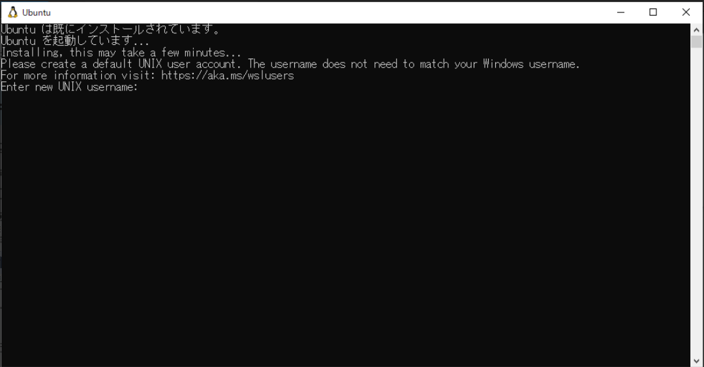
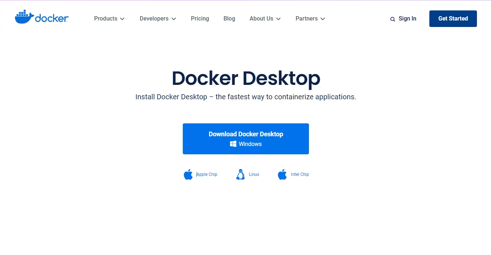
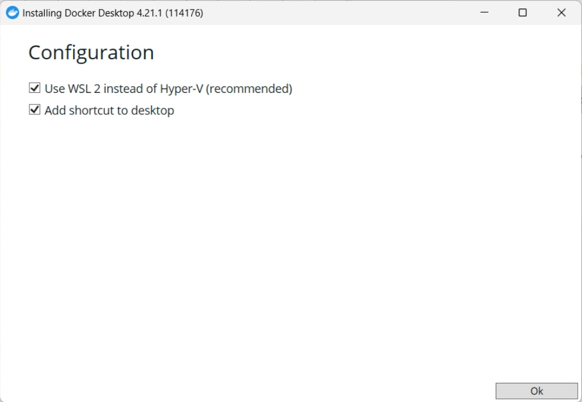
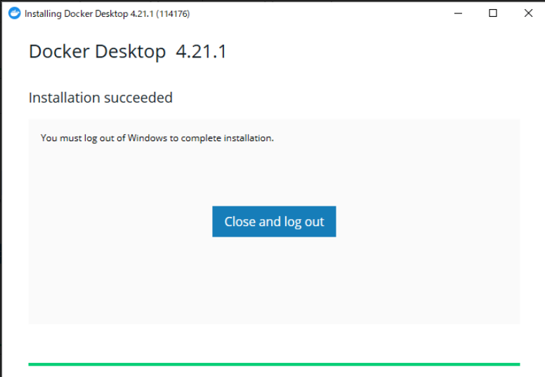
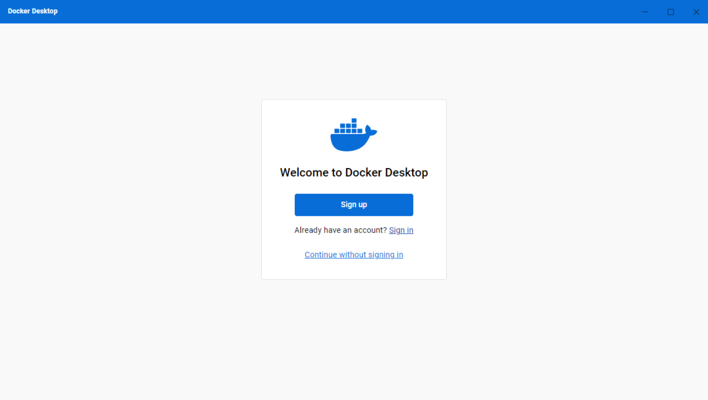
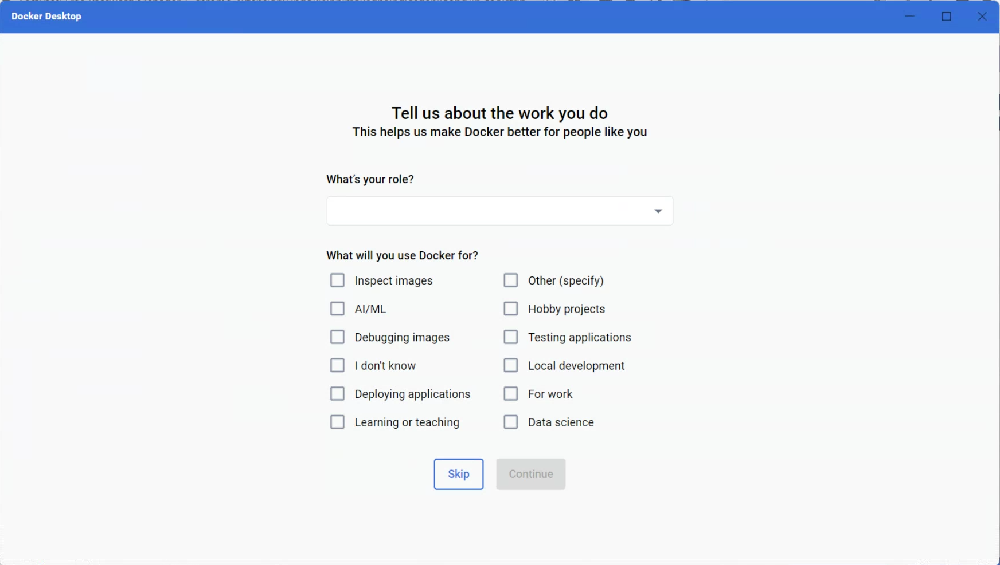
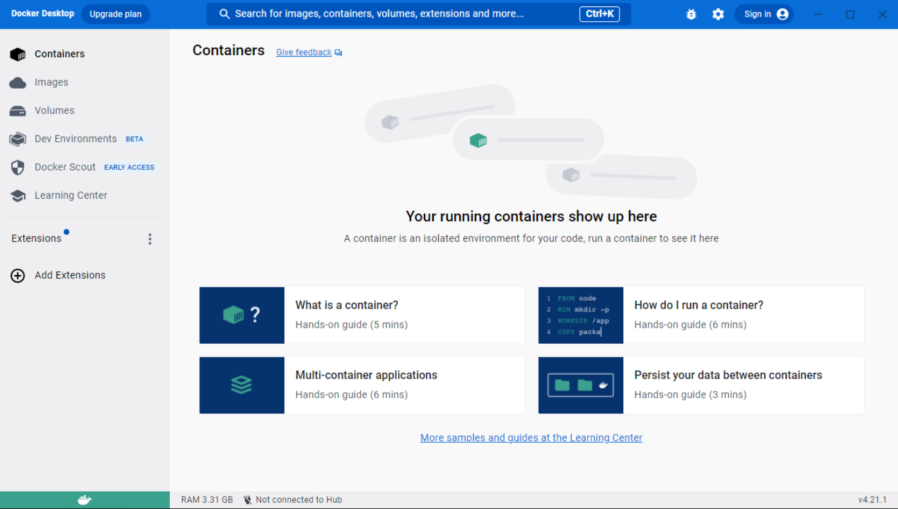

# Windows 向け Docker Desktop・WSL2 セットアップ手順

Windows をお使いの方を対象に、Docker Desktop と WSL2 のインストール手順を説明します。

# 手順
## WSL2 インストール
はじめに、WSL2 をインストールします。
管理者モードで PowerShell または コマンド プロンプトを開き、次のコマンドを⼊⼒してください︓

```
wsl --install
```

<details>
<summary>実行例</summary>

```
Microsoft Windows [Version 10.0.22621.1992]
(c) Microsoft Corporation. All rights reserved.

C:\Windows\System32>wsl --install
インストール中: 仮想マシン プラットフォーム
仮想マシン プラットフォーム はインストールされました。
インストール中: Linux 用 Windows サブシステム
Linux 用 Windows サブシステム はインストールされました。
インストール中: Ubuntu
Ubuntu はインストールされました。
要求された操作は正常に終了しました。変更を有効にするには、システムを再起動する必要があります。
```

</details>

インストールが正常に終了すると、「要求された操作は正常に終了しました。変更を有効にするには、システムを再起動する必要があります。」と表示されますので、お使いのPCを再起動してください。

再起動後、Ubuntu のターミナルが起動します。
ユーザー作成を求められることがありますが、ここでは、作成は不要です。



##  Dokcer Desktop インストール

Docker Desktop インストーラ配布ページにアクセスしてください。  
URL： https://www.docker.com/products/docker-desktop/

「Download Docker Desktop」をクリックし、インストーラをダウンロードしてください。



ダウンロードが完了したら、インストーラを起動してインストールを進めてください。

Configuration に「Use WSL2 instead of Hyper-V(recommended)」が表示されている場合は、チェックを入れてください（画像と同じ状態にしてください）。  
「Add Shortcut to desktop」は、チェックを外しても問題ありません。

チェックを入れたら、「OK」をクリックして、進めてください。



この画面が表示されれば、インストールは完了です。「Close and log out」をクリックすると、自動的にインストーラが終了し、ログアウトが行われます。
※「Close and restart」が表示される場合があります。その場合も「Close and restart」をクリックしてお使いのPCを再起動してください。



## Docker Desktop 起動

Docker Desktop インストール完了後、お使いのPCに再度ログインすると Docker desktop が起動します。
起動しない場合は、スタート メニューにある「Docker Desktop」アイコンをクリックして、Docker Desktop を起動してください。

次のダイアログが表示されますので、「Accept」をクリックしてください。


アカウントをお持ちの方は「Sign in」でサインインしてください。
アカウントをお持ちでない方は「Continue without signing in」をクリックしてください。



「Continue without signing in」をクリックした場合、Docker の利用目的を確認されますので、お答えください。



この画面が表示されれば、Docker Desktop の準備は完了です。


