# ハンズオンガイド <!-- omit in toc -->
本ハンズオンは、こちらに記載の操作手順に沿って進めてください。

<details>
<summary>目次</summary>

- [準備](#準備)
    - [Docker コンテナを起動する](#docker-コンテナを起動する)
- [Notebook から使ってみよう](#notebook-から使ってみよう)
    - [Jupyter notebook 起動](#jupyter-notebook-起動)
    - [接続設定の記載](#接続設定の記載)
    - [Snowpark を使ってみよう](#snowpark-を使ってみよう)
- [dbt から使ってみよう](#dbt-から使ってみよう)
    - [接続情報の記載](#接続情報の記載)
    - [dbt からの接続確認](#dbt-からの接続確認)
    - [SQL でモデルを定義する](#sql-でモデルを定義する)
    - [Python でモデルを定義する](#python-でモデルを定義する)
- [Airflow から動かしてみよう](#airflow-から動かしてみよう)
    - [起動](#起動)
    - [DAG を動かしてみよう](#dag-を動かしてみよう)
    - [dbt を実行してみよう](#dbt-を実行してみよう)
- [ML を動かしてみよう](#ml-を動かしてみよう)
    - [Notebook で Snowpark な ML のコードを書いてみる](#notebook-で-snowpark-な-ml-のコードを書いてみる)
    - [dbt で ML on Snowflake する](#dbt-で-ml-on-snowflake-する)
    - [Airflow × dbt × Snowpark で MLパイプライン](#airflow--dbt--snowpark-で-mlパイプライン)

</details>

## 準備
### Docker コンテナを起動する

本ハンズオンでの Python や dbt、Airflow の操作は Docker コンテナで行います。
配布物を展開したフォルダで、次のコマンドを実行して Docker コンテナを起動してください。

```
$ docker compose up -d && docker compose exec handson bash
```

次のように、ログインができていればOKです。

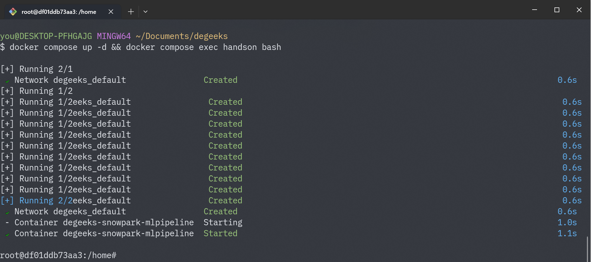

以降、コマンド操作はコンテナで実行します。Docker コンテナを起動したターミナルは、そのまま閉じずにおいてください。

## Notebook から使ってみよう
まずは、Jupyter notebook から Snowpark を使ってみましょう。

Jupyter Notebook とは、ブラウザ上でプログラムの作成・実行が可能な開発環境です。ノートブックというファイルに、コードとテキスト（Markdown 書式対応）、グラフや画像などをまとめて保存可能となっています。
講師の観測範囲では、データ分析者がよく使用している開発環境です。

### Jupyter notebook 起動
インストールが完了したら、Jupyter notebook を起動してください。
Docker コンテナを起動したターミナルで、次のコマンドを実行してください。

```
# cd handson/notebook
# jupyter notebook --port=8888 --ip=* --allow-root
```

Jupyter notebook 起動の際、必要に応じてオプションを変更してください。

<details>
<summary>Jupyter notebookオプション</summary>

- `--port` ：利用可能なポートを指定。（デフォルト（8888）を使用している場合など）
- `--allow-root` ：rootユーザーで起動する場合に指定
- `--ip` ：notebook に接続可能なIPアドレスを指定

</details>

表示されたURLにアクセスし、ブラウザで次のような画面が表示されればOKです。

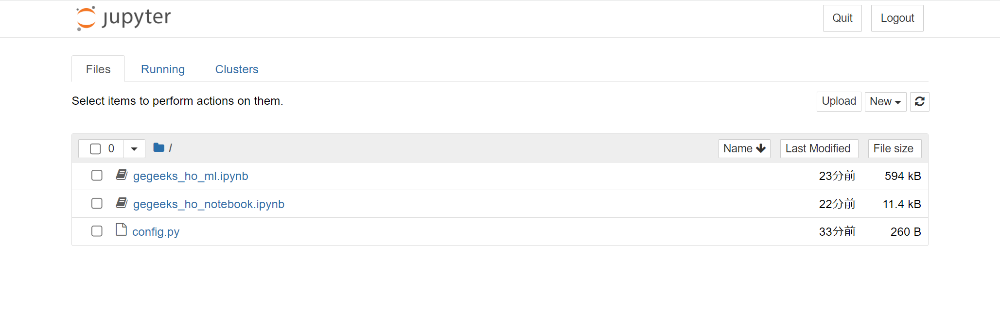

ノートブックを立ち上げたら、早速 Snowpark を使う準備を進めていきましょう。

### 接続設定の記載
`config.py` に、お使いの Snowflake アカウントへの接続情報を記載してください。

```python
connection_parameters = {
    'account': '<org_name>-<account_name>',
    'user': '<your_username>',
    'password': '<your_password>',
    'role': 'SYSADMIN',
    'database': 'DEGEEKS_HO_DB',
    'schema': 'PUBLIC',
    'warehouse': 'DEGEEKS_HO_WH'
}
```

[`account` に指定するアカウント識別子](https://docs.snowflake.com/ja/developer-guide/python-connector/python-connector-api#label-account-format-info)は、Snowsight 左下にあるメニューから「Copy Account Identifier（アカウント識別子をコピー）」をクリックして取得してください。
コピーしたアカウント識別子は `<org_name>-<account_name>` という形式になっています。 `.` を `-` に書き換えて記入してください。

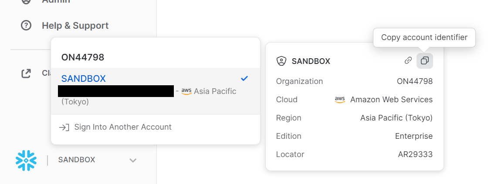

ここまでの準備ができたら、ノートブックを開いて、Snowpark を動かしていきましょう。

### Snowpark を使ってみよう

`gegeeks_ho_notebook.ipynb` を開いてください。
以降は、ノートブック中の説明に従って、進めてください。

> **Note**  
> ご自身でコードを書いていきたい方は、「New」ボタンからノートブックを新規作成し、`gegeeks_ho_notebook.ipynb` を参考にコードを書いてみてください。

## dbt から使ってみよう

次に、dbt でデータ変換モデルを作成してみましょう。

dbtは、データアナリストが扱いなれた SQL を用いて、ソフトウェアエンジニアのようにデータ変換フローの開発を行うためのツールです。現在では、データエンジニアがデータパイプラインを開発する上でもデファクトスタンダードなツールの1つとなっています。
以前までは SQL でモデルを記述するものでしたが、[v1.3](https://docs.getdbt.com/guides/migration/versions/upgrading-to-v1.3) でPython モデルに対応したことで、Snowpark によるモデル記述が可能になりました。

それでは、早速 dbt を実行するための設定を行いましょう。

### 接続情報の記載

`handson/dbt/dbt_ml/profiles.yml` で、`account` `user` `password` にご自身のユーザー情報を記載してください：

```yml
dbt:
  target: dev
  outputs:
    dev:
      type: snowflake
      account: <org_name>-<account_name>
      user: <your_username>
      password: <your_password>
      role: SYSADMIN
      database: DEGEEKS_HO_DB
      warehouse: DEGEEKS_HO_WH
      schema: PUBLIC
      threads: 8
      client_session_keep_alive: False
```

### dbt からの接続確認

先ほど記載した情報で、Snowflake に接続できることを確認します。
ターミナル上で、dbt プロジェクトのフォルダに移動してください。

```
# cd /home/handson/dbt/dbt_ml
```

移動したのち、次のコマンドを実行してください：

```
# dbt debug
```

「All checks passed!」が表示されればOKです。

> **Note**  
> ご自身で dbt コードを書いていきたい方は、`/home/handson/dbt` フォルダで次のコマンドを実行し、新たな dbt プロジェクトを作成してください。
>  
> ```
> # dbt init --skip-profile-setup my_dbt_ml
> ```
>
> プロジェクトを作成したら、 `my_dbt_ml` に移動してください。
> 
> 以降、`dbt_ml` フォルダ下にあるファイルを参考にして、コードを書いてみてください。

### SQL でモデルを定義する

それでは、サンプルデータセット tpc-h を使ったテーブルを dbt で定義してみましょう。
tpc-h の定義は `sources.yml` に記載されています：

```yml
version: 2

sources:
  - name: tpc_h
    database: snowflake_sample_data
    schema: tpch_sf1
    tables:
      - name: orders
      - name: lineitem
  - name: degeeks_ho_db
    schema: public
    tables:
      - name: orders
      - name: lineitem
```

tpc-h を使ったテーブル `example1` は `example1.sql` で定義します：

```sql
{{ config(materialized='table') }}


select
    l_returnflag,
    l_linestatus,
    sum(l_quantity) as sum_qty,
    sum(l_extendedprice) as sum_base_price,
    sum(l_extendedprice * (1-l_discount)) as sum_disc_price,
    sum(l_extendedprice * (1-l_discount) * (1+l_tax)) as sum_charge,
    avg(l_quantity) as avg_qty,
    avg(l_extendedprice) as avg_price,
    avg(l_discount) as avg_disc,
    count(*) as count_order
from
    {{ source('tpc_h', 'lineitem') }}
where
    l_shipdate <= dateadd(day, -90, to_date('1998-12-01'))
group by
    l_returnflag,
    l_linestatus
```

dbt を実行し、モデル定義を実体化させてみましょう。

```
# dbt run --model example1
```

`example1` というテーブルが作成されます。

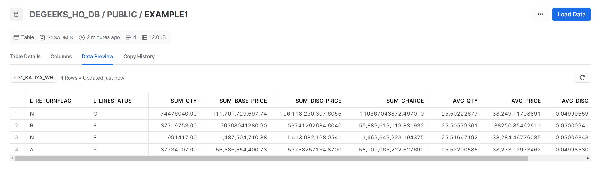


### Python でモデルを定義する

次に、同じく tpc-h を使ったテーブル `example2` を定義します。 `example2.py` で定義します：

```python
from snowflake.snowpark.functions import sum, avg, count, col, dateadd, lit, to_date


def model(dbt, session):
    dbt.config(materialized="table")
    item = dbt.source(
        'tpc_h', 'lineitem'
    ).filter(
        col("l_shipdate") <= dateadd("day", lit(-90), to_date(lit("1998-12-01")))
    ).group_by([
        "l_returnflag",
        "l_linestatus",
    ]).agg(
        sum("l_quantity").name("sum_qty"),
        sum("l_extendedprice").name("sum_base_price"),
        sum(col("l_extendedprice") * (1 - col("l_discount"))).name("sum_disc_price"),
        sum(col("l_extendedprice") * (1 - col("l_discount")) * (1 + col("l_tax"))).name("sum_charge"),
        avg("l_quantity").name("avg_qty"),
        avg("l_extendedprice").name("avg_price"),
        avg("l_discount").name("avg_disc"),
        count("*").name("count_order"),
    )

    return item
```

次のコマンドで実体化してみましょう。

```
# dbt run --model example2
```

`example2` というテーブルが作成されています。なお、集計結果は `example1` も `example2` も同じです。

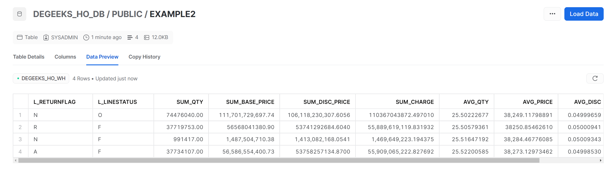


## Airflow から動かしてみよう
さて、続けて Airflow から Snowpark を実行してみましょう。

Apache Airflowとは、様々な処理の依存関係を処理するワークフローエンジンです。ETL（ELT）のパイプラインを構築する際、標準的なワークフローエンジンの1つです。
python で DAG（有向非巡回グラフ） を記述して、依存関係がある複数の処理を実行させることが可能です。

### 起動
まずは Apache Airflowをセットアップしましょう。

> **Note**  
> ご自身で Airflow DAG を書いていきたい方は、新たに Airflow 用のディレクトリを作成し、環境変数 `AIRFLOW_HOME` を設定してください。
> （例： `/home/handson/my_airflow` を使用する場合、`export AIRFLOW_HOME=/home/handson/my_airflow`）
> 
> 以降、`airflow` フォルダ下にあるファイルを参考にして、DAG を書いてみてください。


次のコマンドを実行してください。

```
# cd /home/handson/airflow
# airflow db init
# airflow users create --username admin --firstname hoge --lastname fuga --role Admin --email hoge@example.com --password admin
```

Apache Airflow を起動します。Web アプリとスケジューラの両方を起動する必要があります。

**Web アプリ起動：**

```
# airflow webserver --port 8080
```

**スケジューラ起動**

```
# airflow scheduler
```

### DAG を動かしてみよう

それでは、Webコンソールにログインして、Airflow で DAG を動かしてみましょう。

1. お使いのブラウザで`localhost:8080`にアクセスしてください
2. ログイン画面で ユーザー名: admin、パスワード: admin を入力してください

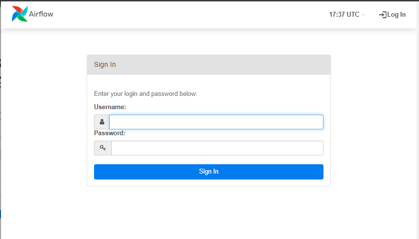

ログインすると、DAG の一覧が表示されます。

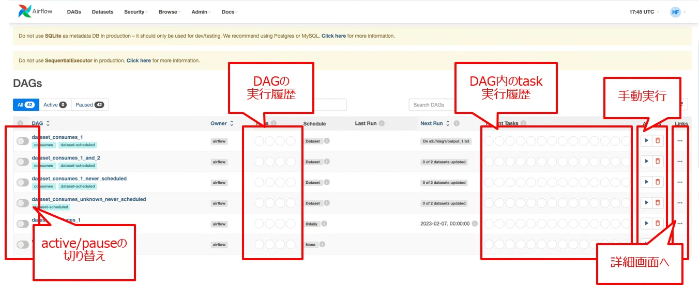

では、最初の DAG を実行し、Hello worldを出力してみましょう。
リストから `dag_example1` を選択してください。

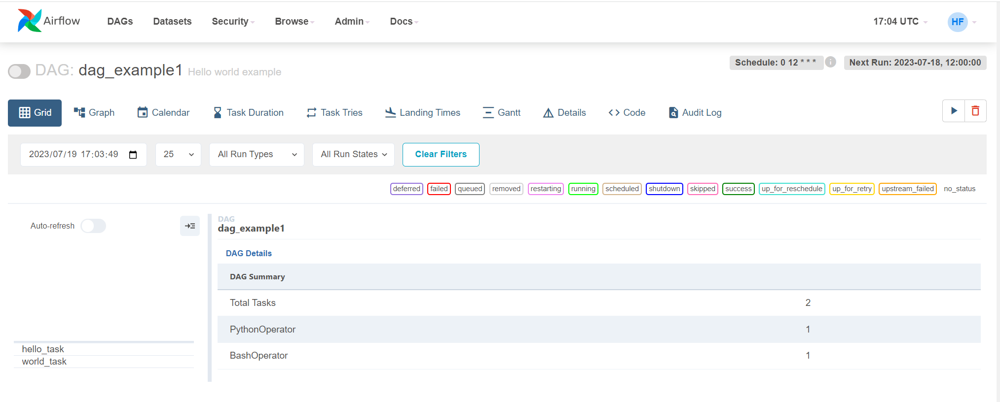

`airflow/dags/dag_example1.py` が、このDAGの定義となっています。

```python
from datetime import datetime
from airflow import DAG
from airflow.operators.bash import BashOperator
from airflow.operators.python_operator import PythonOperator

def print_hello():
    return 'Hello'

dag = DAG(
    dag_id='dag_example1',
    description='Hello world example',
    schedule_interval='0 12 * * *',
    start_date=datetime(2023, 1, 1),
    catchup=False
)

hello = PythonOperator(
    task_id='hello_task',
    python_callable=print_hello,
    dag=dag
)

world = BashOperator(
    task_id='world_task',
    bash_command="echo World!",
    dag=dag
)


hello >> world
```

実行してみましょう。

1. 画面右側「▶️」マークから「Trigger dag」を選択
2. しばらく待つ
3. Success（緑のアイコン）が表示されればOKです

### dbt を実行してみよう

続けて、dbt を実行してみましょう。
実行確認のため、一度 Snowflake 上に作成されたテーブルを削除しておくとよいでしょう。

```sql
drop table example1;
drop table example2;
```

リストから `dag_example2` を選択してください。

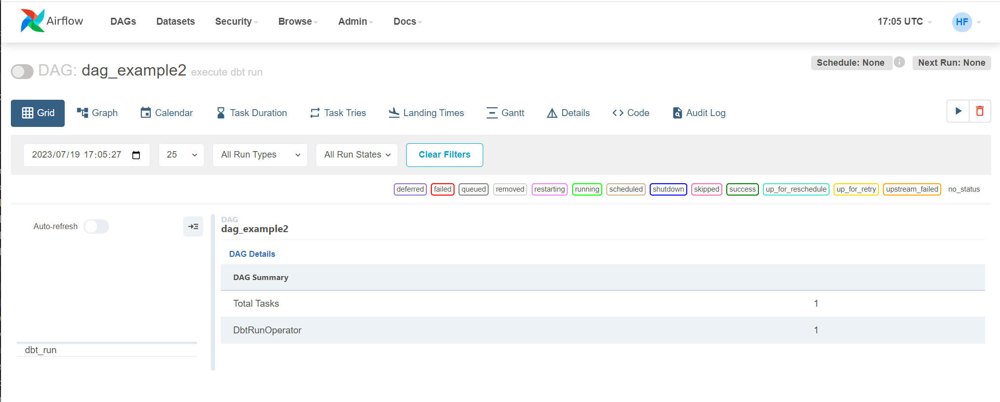

`airflow/dags/dag_example2.py` が、このDAGの定義となっています。

```python
from pendulum import datetime

from airflow import DAG
from airflow_dbt.operators.dbt_operator import (
    DbtRunOperator
)

with DAG(
    dag_id="dag_example2",
    start_date=datetime(2020, 12, 23),
    description="execute dbt run",
    schedule_interval=None,
    catchup=False,
) as dag:

    dbt_run = DbtRunOperator(
        task_id='dbt_run',
        profiles_dir='/home/handson/dbt/ml_dbt',  # dbt --profiles-dir オプションと同じ
        dir='/home/handson/dbt/ml_dbt',
        models='example*'
    )

    dbt_run
```

実行してみましょう。

1. 画面右側「▶️」マークから「Trigger dag」を選択
2. しばらく待つ
3. Success（緑のアイコン）が表示されればOKです

Snowflake上にテーブルが作成されていることを確認してみましょう。

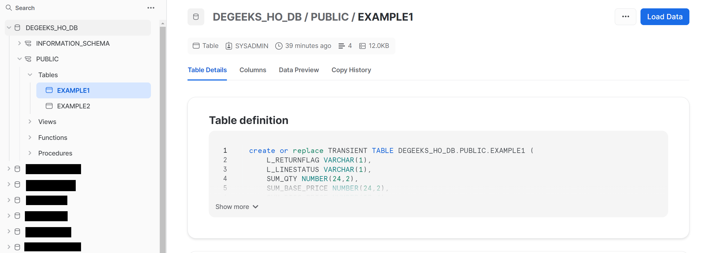

## ML を動かしてみよう
### Notebook で Snowpark な ML のコードを書いてみる
再び Notebook を使用します。
Jupyter notebook を起動して、`gegeeks_ho_ml.ipynb` を開いてください。

```
# cd /home/handson/notebook
# jupyter notebook --port=8888 --ip=* --allow-root
```

以降は、ノートブック中の説明に従って、進めてください。

> **Note**  
> ご自身でコードを書いていきたい方は、「New」ボタンからノートブックを新規作成し、`gegeeks_ho_ml.ipynb` を参考にコードを書いてみてください。

### dbt で ML on Snowflake する

先ほどのモデルを dbt に移植してみましょう。「dbt から使ってみよう」の作業ディレクトリ `ml_dbt` に移動してください。

```
# cd /home/handson/dbt/ml_dbt
```

特徴量作成、トレーニングセット・テストセット作成、学習と予測のモデルを実行してみましょう。それぞれのモデルは次のファイルに記載されています。

- 特徴量作成： `models/feature.sql`

<details>
<summary>クエリ</summary>


```sql
with orders as(
    select
        *
    from
        {{ source('tpc_h', 'orders') }}
), lineitem as (
    select
        *
    from
        {{ source('tpc_h', 'lineitem') }}
)
select
    orders.o_orderdate as order_date,
    sum(l_extendedprice) as sum_base_price,  -- 合計価格
    avg(sum_base_price) over (
        order by order_date asc 
        rows between 2 preceding and current row) as moving_3day_sum_base_price_avg, -- 合計金額の3日間移動平均
    avg(sum_base_price) over (
        order by order_date asc 
        rows between 6 preceding and current row) as moving_week_sum_base_price_avg, -- 合計金額の7日間移動平均
    sum(l_extendedprice * (1-l_discount)) as sum_disc_price,  -- 割引合計価格
    sum(l_extendedprice * (1-l_discount) * (1+l_tax)) as sum_charge, -- 割引合計価格+税金
    sum(l_quantity) as sum_qty, -- 合計数量
    avg(sum_qty) over (
        order by order_date asc 
        rows between 2 preceding and current row) as moving_3day_sum_qty_avg, -- 合計数量の3日間移動平均
    avg(sum_qty) over (
        order by order_date asc 
        rows between 6 preceding and current row) as moving_week_sum_qty_avg, -- 合計数量の7日間移動平均
    avg(l_quantity) as avg_qty,  -- 平均数量
    avg(l_extendedprice) as avg_price,  -- 平均合計価格
    avg(l_discount) as avg_disc,  -- 平均割引の合計
    count(distinct l_orderkey) as count_order  -- 注文件数
from
    lineitem
inner join 
    orders 
    on orders.o_orderkey = lineitem.l_orderkey
group by order_date
order by order_date asc
```

</details>

- トレーニングセット： `/models/train.sql`

<details>
<summary>クエリ</summary>


```sql
select
    *
from
    {{ ref('feature') }}
where
    order_date <= '1997-12-31'::date
```

</details>

- テストセット： `/models/test.sql`

<details>
<summary>クエリ</summary>


```sql
select
    *
from
    {{ ref('feature') }}
where
    order_date >= '1998-01-01'::date
    and order_date <= '1998-03-31'::date
```

</details>

- 学習と予測： `/models/regression_model.py`

<details>
<summary>クエリ</summary>


```python
def model(dbt, session):
    # Must be either table or incremental (view is not currently supported)
    dbt.config(
        materialized = "table",
        packages=["xgboost", "pandas", "numpy"]
    )
    from xgboost import XGBRegressor
    import pandas as pd
    import numpy as np


    # DataFrame representing an upstream model
    df_train = dbt.ref("train")
    df_train = df_train.to_pandas()
    df_test = dbt.ref("test")
    df_test = df_test.to_pandas()

    feature_cols = list(df_train.columns)
    # target_col = 'SUM_BASE_PRICE'  # 当たりすぎる
    target_col = 'COUNT_ORDER'
    feature_cols.remove(target_col)
    feature_cols.remove('ORDER_DATE')

    X = df_train[feature_cols].values
    y = df_train[target_col].values
    
    # TypeError('Not supported type for data.' + str(type(data)))
    
    # 学習
    xgbmodel = XGBRegressor(random_state=123)
    xgbmodel.fit(X,y)
 
    y_pred = xgbmodel.predict(df_test[feature_cols].values)
    
    # Add a new column containing the id incremented by one
    df = df_test[['ORDER_DATE', target_col]]
    df["COUNT_ORDER_PRED"] = y_pred

    return df
```

</details>

次のコマンドを実行してみましょう。

```
# dbt run --select +regression_model
```

「Completed successfully」 になれば、学習＆予測完了です！

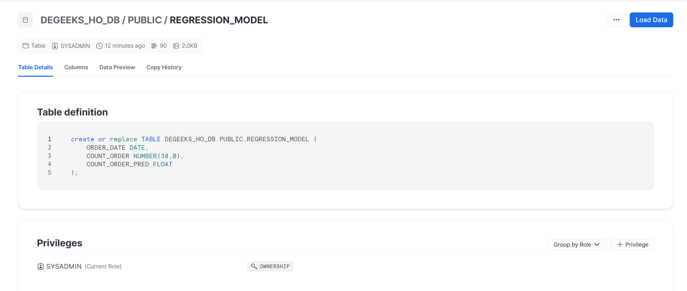


### Airflow × dbt × Snowpark で MLパイプライン

最後に、dbt で定義した Snowpark ML モデルを Airflow で実行してみましょう。
「Airflow から動かしてみよう」と同様の手順で Apache Airflow を起動します。

**Web UIの起動**

```
# airflow webserver --port 8080
```

**スケジューラの起動（別ターミナルを起動してください）**

```
# airflow scheduler
```

リストから `dag_example3` を選択してください。

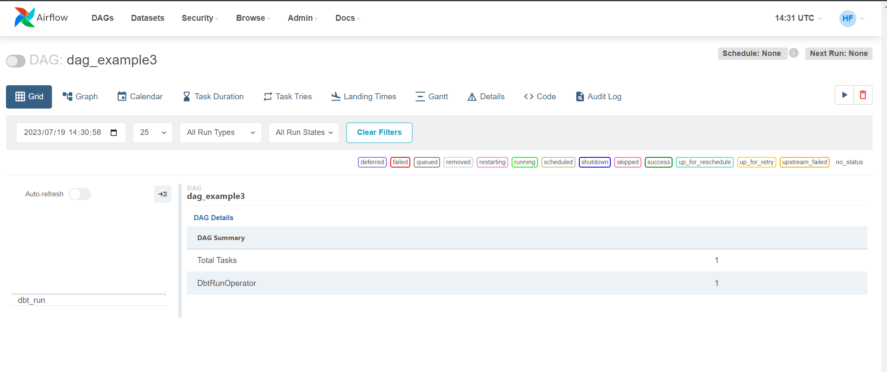

`airflow/dags/dag_example3.py` が、このDAGの定義となっています。

```python
from airflow import DAG
from airflow_dbt.operators.dbt_operator import (
    DbtRunOperator
)
from airflow.utils.dates import days_ago

default_args = {
    'start_date': days_ago(0),
    'retries': 0,
}

with DAG(dag_id='dag_example3', default_args=default_args, schedule_interval=None) as dag:
    dbt_run = DbtRunOperator(
        task_id='dbt_run',
        profiles_dir='/home/dbt/dbt/',  # dbt --profiles-dir オプションと同じ。お使いの環境に合わせて修正してください
        dir='/home/dbt/dbt'  # ここで dbt コマンドを実行。お使いの環境に合わせて修正してください
    )

dbt_run
```

実行する前に、Snowflake 上のテーブルを削除しておきましょう。

```sql
drop table regression_model;
```

削除したら、DAGを手動実行してください（ 「Airflow から動かしてみよう」参照）

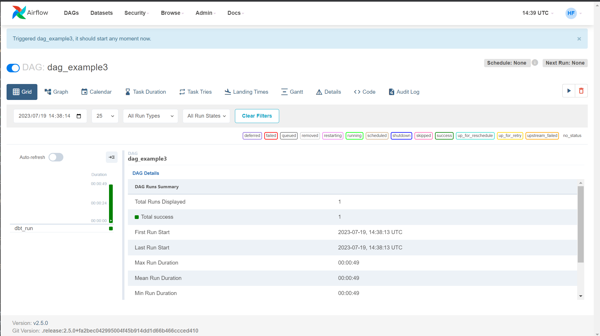

DAGが正常終了していることを確認したら、Snowflake上にテーブルが作成されていることを確認しましょう。


これで、Airflow と dbt と Snowpark による MLパイプラインを動かすことができました。

